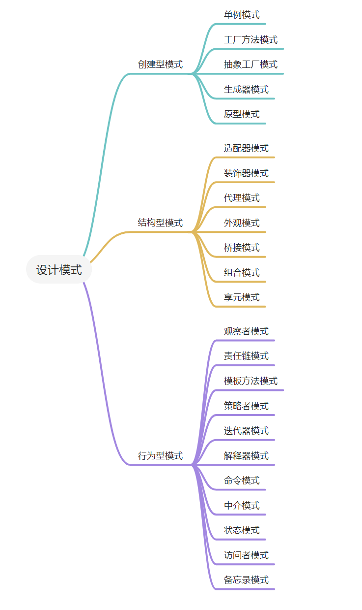
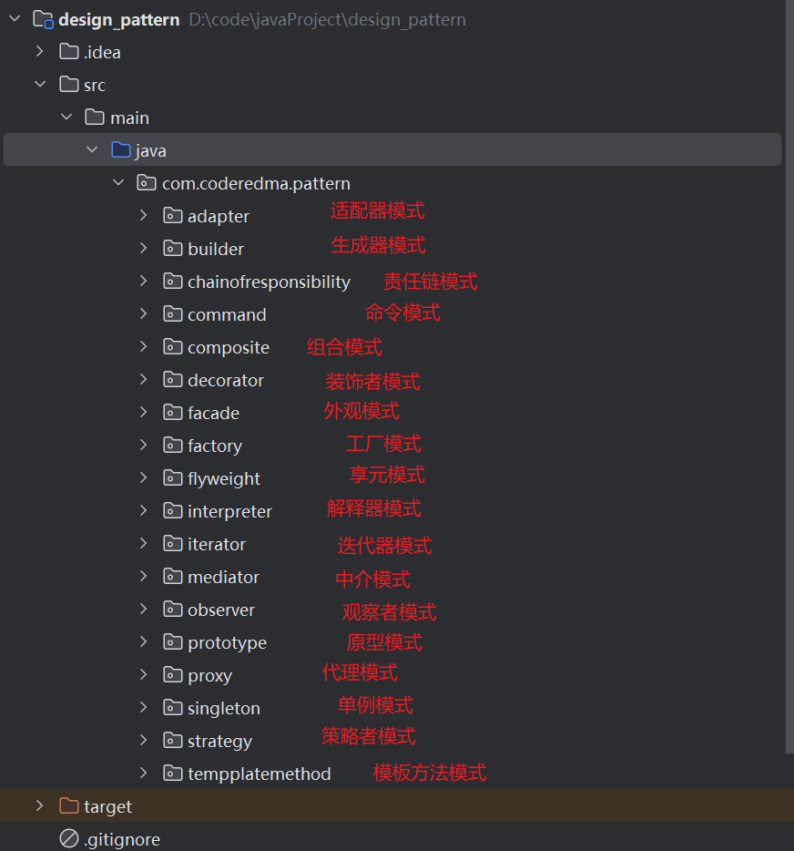

# 设计模式

设计模式是在软件工程领域中一种经过验证的解决方案，用于解决在特定情况下经常出现的设计问题。设计模式提供了一种通用的语言，帮助开发人员描述问题、解决方案以及如何实现解决方案。它们不是具体的代码，而是描述了解决问题的模板或蓝图，可以应用于多种编程语言和环境。

设计模式通常分为三大类：创建型模式、结构型模式和行为型模式。

## 设计模式分类

### 1. 创建型模式：
    - 单例模式：保证一个类仅有一个实例，并提供一个访问它的全局访问点。
    - 工厂模式：定义一个创建对象的接口，让其子类自己决定实例化哪一个工厂类，工厂模式使其创建过程延迟到子类进行。
    - 抽象工厂模式：提供一个创建一系列相关或相互依赖对象的接口，而无需指定它们具体的类。
    - 建造者模式：将一个复杂对象的构建与它的表示分离，使得同样的构建过程可以创建不同的表示。
    - 原型模式：用原型实例指定创建对象的种类，并且通过拷贝这些原型创建新的对象。
### 2. 结构型模式:
    - 适配器模式：将一个类的接口转换成客户希望的另外一个接口，使得原本由于接口不兼容而不能一起工作的那些类可以一起工作。
    - 桥接模式：将抽象与实现分离，使它们可以独立变化。
    - 组合模式：将对象组合成树形结构以表示“部分-整体”的层次结构，使得用户对单个对象和组合对象的使用具有一致性。
    - 装饰者模式：动态地给一个对象添加一些额外的职责，就增加功能来说，装饰者模式比生成子类更灵活。
    - 外观模式：为子系统中的一组接口提供一个一致的界面，使子系统更容易使用。
    - 享元模式：运用共享技术有效地支持大量细粒度的对象。
    - 桥接模式：将抽象与实现分离，使得它们可以独立变化。
### 3. 行为型模式:
    - 策略模式：定义了一系列算法，并将每个算法封装起来，使它们可以相互替换，且算法的变化不会影响使用算法的客户。
    - 模板方法模式：定义一个操作中算法的框架，而将一些步骤延迟到子类中，使得子类可以不改变算法的结构即可重定义该算法的某些特定
    - 命令模式：将一个请求封装为一个对象，从而使你可用不同的请求对客户进行参数化；对请求排队或记录请求日志，以及支持可撤销的操作。
    - 迭代器模式：提供一种方法顺序访问一个聚合对象中的各个元素，而又不暴露该对象的内部表示。
    - 中介者模式：用一个中介对象来封装一系列的对象交互，使对象之间的耦合松散，而且可以独立地改变它们之间的交互。
    - 观察者模式：定义对象间的一种一对多的依赖关系，当一个对象的状态发生改变时，所有依赖于它的对象都得到通知并被自动更新。
    - 访问者模式：表示一个作用于某对象结构中的各元素的操作，它可以在不改变各元素的类的前提下定义作用于这些元素的新操作。
    - 备忘录模式：在不破坏封装性的前提下，捕获一个对象的内部状态，并在该对象之外保存这个状态，这样可以在以后将对象恢复到原先保存的状态。
    - 状态模式：允许一个对象在其内部状态发生改变时改变其行为能力。
    - 解释器模式：给定一个语言，定义它的文法表示，并定义一个解释器，这个解释器使用该标识来解释语言中的句子。
    - 责任链模式：使多个对象都有机会处理请求，从而避免请求的发送者和接收者之间的耦合关系，将这些对象连成一条链，并沿着这条链传递该请求，直到有一个对象处理它为止。
## 目录结构介绍

## 常用模式介绍

### 1. 单例模式

### 2. 工厂模式

### 3. 装饰器模式

### 4. 观察者模式

### 5. 责任链模式

### 6. 迭代器模式

## 文章参考
https://github.com/youlookwhat/DesignPattern
https://blog.csdn.net/A1342772/article/details/91349142

如有侵权，请联系我，我会及时删除。

